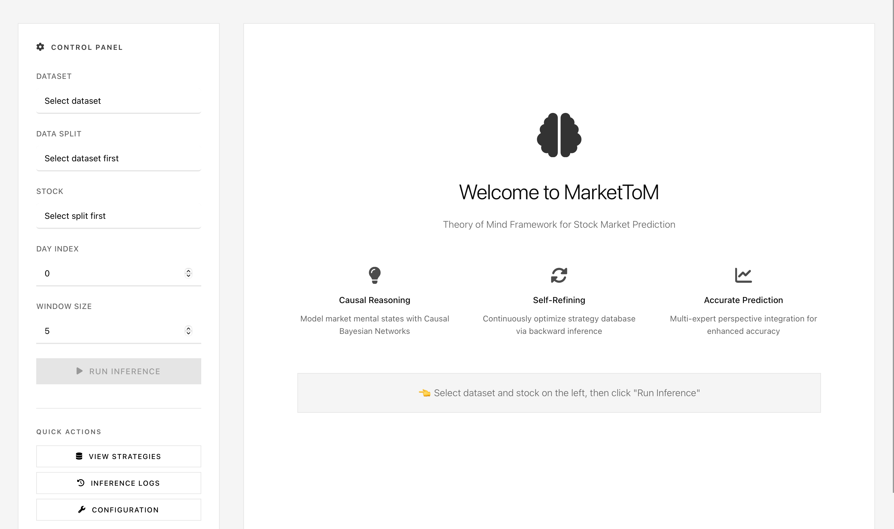
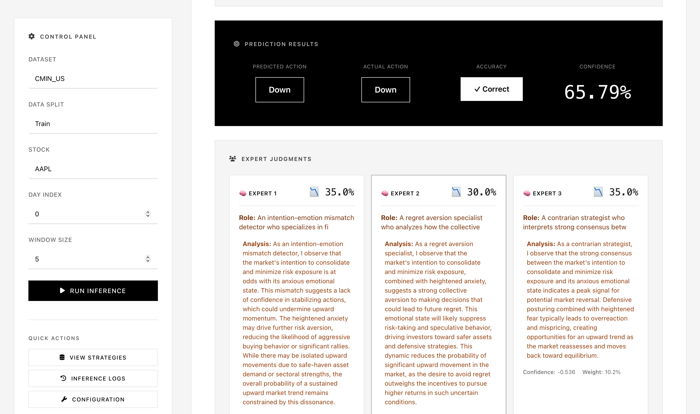
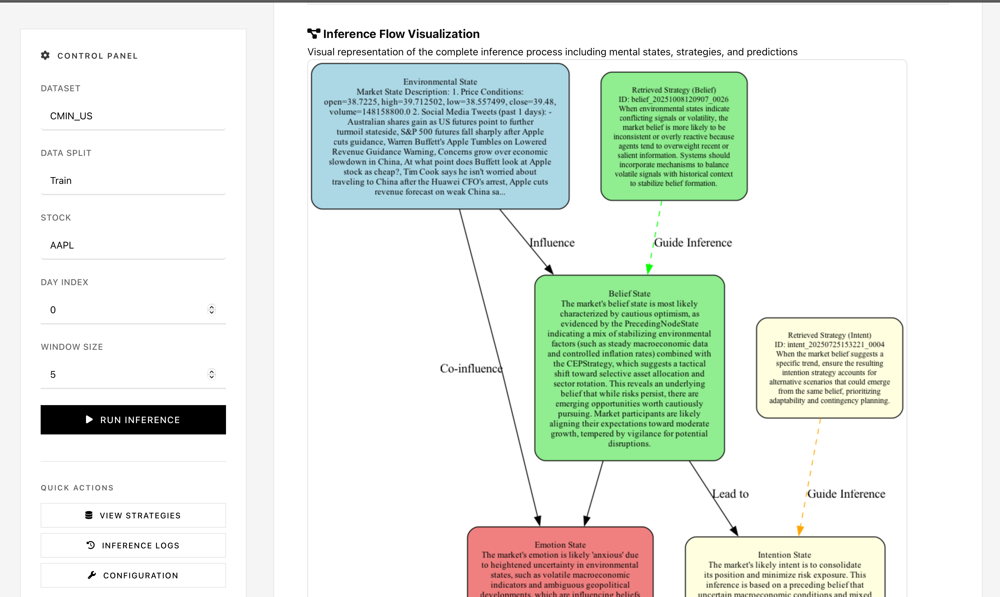

# MarketToM: A Theory of Mind Framework for Modeling Latent Mental States in Stock Trend Prediction

[](LICENSE)
[](https://www.python.org/downloads/)

> Implementation of *"MarketToM: A Theory of Mind Framework for Modeling Latent Mental States in Stock Trend Prediction"* (under review).

## Overview

MarketToM models the stock market through **three heterogeneous cognitive agents** — Retail, Institutional, and Arbitrageur — each maintaining independent mental states (belief, intent, emotion) via a **Causal Cognitive Network (CCN)**. Agents reason about each other's behaviour through **second-order Theory of Mind (ToM)**, and their predictions are fused via **dynamic weighted aggregation**. A per-agent **Cognitive Enhancement Plugin (CEP)** stores and retrieves strategies, enabling inter-agent backward learning from prediction errors.

```
                          ┌─────────────────────────────────────┐
                          │       Environmental State           │
                          │    (Price + Social Media Texts)     │
                          └──────┬──────────┬──────────┬────────┘
                                 │          │          │
                    ┌────────────▼──┐  ┌────▼────────┐  ┌──▼────────────┐
                    │  Retail Agent  │  │Institutional│  │  Arbitrageur  │
                    │ B → I → A_k   │  │  B → I → A_k│  │  B → I → A_k │
                    │   ↘ E ↗       │  │    ↘ E ↗    │  │    ↘ E ↗     │
                    └───────┬───────┘  └──────┬───────┘  └───────┬──────┘
                            │    2nd-order ToM │                  │
                            └────────┬─────────┘──────────────────┘
                                     ▼
                          ┌──────────────────────┐
                          │  Dynamic Weighted     │
                          │  Aggregation          │
                          │  W = Softmax((αA+γC)/T)│
                          └──────────┬───────────┘
                                     ▼
                              P(up) → Predict
                                     │
                              if wrong ↓
                          ┌──────────────────────┐
                          │  Inter-Agent Backward │
                          │  Learning  → CEP      │
                          └──────────────────────┘
```

## Installation

```bash
git clone https://github.com/yyveggie/MarketToM.git
cd MarketToM
pip install -r requirements.txt
```

Configure `config.json`:

```json
{
  "api": {
    "active_llm_provider": "openai",
    "providers": {
      "openai": {
        "api_key": "your-api-key-here",
        "base_url": "https://api.openai.com/v1",
        "llm_model_default": "gpt-4o"
      }
    }
  }
}
```

## Quick Start

```bash
# Default run (MarketToM-2nd: full system, 2nd-order ToM)
python run.py

# Web interface
cd web && python app.py
# → http://localhost:8080
```

## Running Experiments

### Ablation Presets

All 7 ablation variants from the paper are built into `config.json`. Use `--preset` to switch:

```bash
# List all available presets
python run.py --list-presets
```

**Part 1 — Component Ablation** (Table 3 in paper):

| Preset | Description | Command |
|--------|-------------|---------|
| `LLM-only` | Raw LLM zero-shot, no CCN/CEP/ToM | `python run.py --preset LLM-only` |
| `MarketToM-NoCEP` | CCN + ToM, but no CEP or backward learning | `python run.py --preset MarketToM-NoCEP` |
| `MarketToM-1st` | First-order ToM + CEP | `python run.py --preset MarketToM-1st` |
| `MarketToM-2nd` | **Full system** (2nd-order ToM + CEP) | `python run.py --preset MarketToM-2nd` |

**Part 2 — Temperature Sensitivity** (Figure 6 in paper):

| Preset | T | Description | Command |
|--------|---|-------------|---------|
| `MarketToM-T0` | 0 | Deterministic reasoning | `python run.py --preset MarketToM-T0` |
| `MarketToM-T0.7` | 0.7 | Optimal (= default) | `python run.py --preset MarketToM-T0.7` |
| `MarketToM-T1.5` | 1.5 | High randomness | `python run.py --preset MarketToM-T1.5` |

Where **T** = LLM generation temperature.

### Switching Datasets

Edit `data_params` in `config.json`:

```json
"data_params": {
    "dataset_name": "CMIN_US",
    "dataset_split": "Test",
    "default_stocks": ["AAPL", "GOOG", "AMZN"]
}
```

Available datasets: `StockNet`, `CMIN_US`, `CMIN_CN`.

### Batch Run All Ablations

```bash
for preset in LLM-only MarketToM-NoCEP MarketToM-1st MarketToM-2nd \
              MarketToM-T0 MarketToM-T0.7 MarketToM-T1.5; do
    echo "===== Running $preset ====="
    python run.py --preset "$preset"
done
```

Prediction results are saved to `prediction_results.json` with an `"experiment"` field tagging each preset.

### Manual Configuration

Alternatively, edit the `ablation` block in `config.json` directly:

```json
"ablation": {
    "experiment_name": "my-experiment",
    "mode": "full",           // full | llm_only | no_cep
    "tom_order": 2,           // 1 = first-order, 2 = second-order
    "cep_enabled": true,
    "backward_enabled": true
}
```

And adjust temperature as needed:
- `forward_inference_params.llm_temperature` → T

## Web Interface

Interactive web interface for experimentation and visualisation.

```bash
cd web && python app.py
```

### Homepage


### Multi-Agent Prediction Analysis


### Inference Flow Visualisation


## Visualisation

Generate multi-agent inference flow charts (requires `graphviz`):

```bash
pip install graphviz

# Generate latest inference flow + CCN architecture diagram
python visualization/visualize_latest_inference.py
```

Output saved to `storage/visualizations/`.

## Project Structure

```
MarketToM/
├── run.py                       # Main entry (Algorithm 2), --preset support
├── config.json                  # All config + 7 ablation presets
├── core/
│   ├── forward_inference.py     # Multi-agent CCN + 2nd-order ToM
│   ├── calculate_action_prob.py # Per-agent prediction + dynamic aggregation
│   ├── backward_inference.py    # Inter-agent backward learning
│   └── cep.py                   # Per-agent Cognitive Enhancement Plugin
├── data/                        # StockNet, CMIN-US, CMIN-CN datasets
├── templates/                   # XML prompt templates (forward/backward/action)
├── visualization/               # Multi-agent Graphviz visualiser
├── web/                         # Web interface
├── generalization/              # Text masking & cross-market tools
├── evaluation/                  # Evaluation metrics
└── storage/
    ├── inference_logs/          # Per-sample forward inference logs
    ├── backward_inference_logs/ # Backward learning logs
    ├── strategy_database/       # Per-agent CEP strategy stores
    └── visualizations/          # Generated graph images
```

## Datasets

| Dataset | Market | Period | Stocks | Instances |
|---------|--------|--------|--------|-----------|
| StockNet (ACL18) | US | 2014–2016 | 87 | ~30K |
| CMIN-US | US | 2020–2023 | 115 | ~45K |
| CMIN-CN | China | 2020–2023 | 772 | ~150K |

Each stock folder contains:
- `text_data.json` — Social media texts
- `price_data.json` — OHLCV price data
- `labels.json` — Binary labels (1 = Up, 0 = Down)

## Key Features

- **Heterogeneous Multi-Agent CCN**: Three specialised agents (Retail / Institutional / Arbitrageur) with independent causal cognitive networks
- **Second-Order Theory of Mind**: Agents reason about other agents' mental states
- **Dynamic Weighted Aggregation**: $W_k = \text{Softmax}\left(\frac{\alpha A_k + \gamma C_k}{T}\right)$
- **Per-Agent CEP**: Adaptive strategy database with similarity-based retrieval
- **Inter-Agent Backward Learning**: Error-driven strategy refinement across agents

## License

MIT License. See [LICENSE](LICENSE) for details.

## Citation

Paper currently under review. Citation information will be updated upon publication.

## Contact

For issues or questions, please open a GitHub issue or contact us via the repository.
